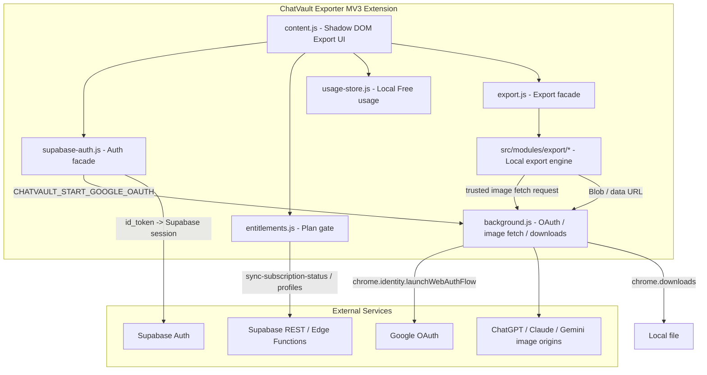

# ChatVault Exporter - 技术设计文档 (Technical Design)

## 1. 架构概述

`ChatVault Exporter` 是一款 Manifest V3 Chrome 扩展，基于原生 JavaScript (ES6) 编写，不引入 React / Vue / TypeScript 或大型运行时框架。

核心原则：

- 导出正文只在浏览器本地解析和构建。
- PDF / Word / PNG / Markdown 均在浏览器本地生成，不使用自有服务器转档。
- 导出引擎复用 `ChatVault AI / ChatFolder AI` 中已验证的导出模块。
- 新产品只保留账号、订阅、导出、下载和必要的本地 Free 额度记录。
- 不引入聊天历史索引同步、文件夹、书签、本地知识库等主产品管理能力。



---

## 2. 目录与文件结构

建议从主产品复制最小必要文件，并通过同步脚本保持导出核心一致。

```text
ChatVault Exporter/
├── manifest.json
├── package.json
├── welcome.html                 # 安装欢迎页 / 引导页，不承载跨扩展 Session 广播
├── welcome.js
├── welcome.css
├── images/
├── scripts/
│   └── sync-core.mjs            # 从主产品同步共享导出核心与测试夹具
├── tests/
│   ├── exporter-entitlements.test.mjs
│   ├── exporter-usage.test.mjs
│   ├── privacy-proof.test.mjs
│   ├── export-health.test.mjs
│   ├── redaction.test.mjs
│   ├── export-receipt.test.mjs
│   └── export-fixtures.test.mjs # 复用主产品导出 fixture
└── src/
    ├── background.js            # Google OAuth、可信图片拉取、下载触发、右键菜单
    ├── content.js               # 非侵入式导出入口与配置面板
    ├── content.css
    ├── supabase-config.js       # 与主产品共享 Supabase URL / Anon Key / Google Client ID
    ├── supabase-api.js
    ├── supabase-auth.js
    └── modules/
        ├── analytics.js         # 只记录导出事件和非敏感错误，不记录正文
        ├── billing.js           # Checkout / Restore purchase
        ├── entitlements.js      # Free / Pro 权限判断
        ├── usage-store.js       # Exporter 专用本地 Free 导出计数
        ├── privacy-proof.js     # 本地导出证明与处理链路说明
        ├── export-health.js     # 导出前质量检查
        ├── redaction.js         # 本地敏感信息脱敏
        ├── template-presets.js  # 场景化导出模板
        ├── export-receipt.js    # 可验证导出凭证与 hash
        ├── developer-export.js  # 代码块索引与后续 zip 导出
        ├── share-cards.js       # 单条回答卡片与分镜长图配置
        ├── export-ui-controller.js
        ├── export-message-adapter.js
        ├── export.js            # 导出 facade，动态加载 export/*
        └── export/
            ├── utils.js
            ├── platform.js
            ├── parser-dom.js
            ├── media.js
            ├── zip.js
            ├── save.js
            ├── selection.js
            ├── engine.js
            └── builders/
                ├── docx.js
                ├── image.js
                └── pdf.js
```

说明：

- 不建议把主产品完整 `content.js` 复制后删除功能；应新建轻量 `content.js`，只组合导出、账号、订阅、额度和 UI。
- `local-store.js` 可以不整体复用。Exporter 只需要 `usage-store.js`，避免把 folders / bookmarks / history 结构带进来。
- `export-message-adapter.js` 可复用主产品模式，但只保留当前会话导出和平台校验，不做跨历史列表导出。

---

## 3. Manifest 权限设计

### 3.1 必要权限

```json
{
  "permissions": ["storage", "downloads", "identity", "contextMenus"]
}
```

说明：

- `storage`：保存登录 session、本地 Free 额度和轻量设置。
- `downloads`：通过 background 统一触发下载。
- `identity`：使用 `chrome.identity.launchWebAuthFlow` 完成 Google OAuth。
- `contextMenus`：提供右键快速导出入口。若后续决定把右键入口改成可选能力，必须改入 `optional_permissions` 并补充 `chrome.permissions.request` 的授权流程；否则菜单不会稳定创建。

不建议默认加入：

- `activeTab`：固定 content script 注入时不需要。
- `scripting`：不动态注入脚本时不需要。
- `tabs`：若只打开 checkout / welcome 页面，可优先用 `chrome.tabs` 时再评估；无法避免时再加入。
- `storage.sync`：Free 额度和隐私设置使用 `chrome.storage.local`。

### 3.2 Host permissions

必须包含：

```json
[
  "https://<supabase-project>.supabase.co/*",
  "https://chatgpt.com/*",
  "https://chat.openai.com/*",
  "https://claude.ai/*",
  "https://gemini.google.com/*"
]
```

为保留导出图片，还需要可信图片来源：

```json
[
  "https://*.oaiusercontent.com/*",
  "https://*.googleusercontent.com/*",
  "https://images.anthropic.com/*",
  "https://media.anthropic.com/*",
  "https://lh0.google.com/*",
  "https://lh1.google.com/*",
  "https://lh2.google.com/*",
  "https://lh3.google.com/*",
  "https://lh4.google.com/*",
  "https://lh5.google.com/*",
  "https://lh6.google.com/*",
  "https://lh7.google.com/*",
  "https://lh8.google.com/*",
  "https://lh9.google.com/*"
]
```

### 3.3 Web accessible resources

`export.js` 会通过动态 `import(chrome.runtime.getURL(...))` 加载导出子模块，因此 `web_accessible_resources` 必须包含：

```json
[
  "src/modules/export/utils.js",
  "src/modules/export/platform.js",
  "src/modules/export/parser-dom.js",
  "src/modules/export/media.js",
  "src/modules/export/zip.js",
  "src/modules/export/save.js",
  "src/modules/export/selection.js",
  "src/modules/export/engine.js",
  "src/modules/export/builders/docx.js",
  "src/modules/export/builders/image.js",
  "src/modules/export/builders/pdf.js"
]
```

漏掉任一文件都会导致真实扩展环境下动态模块加载失败。

---

## 4. 账号与 VIP 系统

### 4.1 登录方式

不采用“`welcome.js` 向多个扩展 ID 广播 session”的方案。

原因：

- 当前主产品已经使用 `chrome.identity.launchWebAuthFlow`，不是传统 `welcome.html` hash 回调模式。
- 向另一个扩展传递 session / token 会扩大敏感信息暴露面。
- 两个扩展共享 Pro 权益不需要共享本地 session，只需要共享 Supabase 用户和订阅状态。

推荐方案：

1. 两个扩展使用相同的 `SUPABASE_URL`、`SUPABASE_ANON_KEY` 和 Google OAuth Client ID。
2. Exporter 独立完成 Google OAuth。
3. `background.js` 通过 `chrome.identity.launchWebAuthFlow` 获取 Google `id_token`。
4. `supabase-auth.js` 调用 Supabase `/auth/v1/token?grant_type=id_token` 换取 session。
5. session 只保存在 Exporter 自己的 `chrome.storage.local`。

`welcome.html` 只作为安装欢迎页、隐私说明页或快速打开平台的引导页，不负责跨扩展 session 回传。

### 4.2 Pro 权益刷新

Pro 不能只依赖 `profiles.plan` 的本地缓存。Signed-in 用户应按以下顺序加载权益：

1. 调用 `/functions/v1/sync-subscription-status`，让后端根据支付状态同步 `profiles.plan` 和 `profiles.feature_flags.payment`。
2. 如果 Edge Function 临时失败，fallback 到 `profiles?on_conflict=id&select=id,email,plan,feature_flags,limits,updated_at`。
3. 本地缓存 profile，但 Pro gate 需要 freshness 判断。
4. Pro 到期时间从 `feature_flags.payment.currentPeriodEnd` 读取；到期后回落 Free，后台可按间隔重试刷新。

### 4.3 Checkout / Restore

复用主产品 `billing.js` 的支付创建逻辑，但文案要改为 Exporter：

- Pro exports。
- Premium report themes。
- Higher image limits。
- Hide watermark。
- Shared Pro with ChatVault AI。

避免出现“folders / bookmarks / sync all year”等主产品专属权益文案。

---

## 5. Free 额度与本地使用记录

### 5.1 Guest Free

未登录用户可以直接导出。Guest Free 使用本地记录：

```javascript
const EXPORTER_USAGE_KEY = "chatvault_exporter_daily_usage";

{
  date: "2026-06-07",
  exportedChats: 1,
  exportEvents: [
    {
      at: "2026-06-07T10:30:00.000Z",
      count: 1,
      format: "pdf",
      mode: "conversation"
    }
  ]
}
```

规则：

- 每日按浏览器本地日期 `YYYY-MM-DD` 重置。
- Free 每日 3 次。
- 当前会话整篇、AI-only、选择消息、单条回答都按 1 次成功导出计数。
- 用户取消下载、导出失败、Blob 构建失败不计数。
- 后续如果支持批量跨会话导出，按成功导出的唯一会话数计数。

注意：本地额度不是强风控。用户清空扩展存储可以重置，这是隐私优先产品可接受的取舍。

### 5.2 Signed-in Free

已登录 Free 用户仍使用 Free 限制。建议优先复用主产品的 `free_daily_usage` 设置结构，以便两个产品的 Free 规则一致。

如需保持 Exporter 独立额度，可使用 Exporter 专用 key，但文档和 UI 必须说明两个产品的免费额度是否共享。

建议 MVP：Exporter 使用独立 Free 额度；Pro 权益共享。

### 5.3 Pro

Pro 用户不受每日导出次数限制，但仍受浏览器内存、canvas 最大像素、图片请求、平台页面可读性等技术上限保护。

---

## 6. Content Script 设计

`content.js` 只承担以下职责：

- 检测当前平台。
- 注入 Shadow DOM Export 按钮。
- 展示导出配置 Drawer / Modal。
- 读取登录状态和权益。
- 调用 `CHATVAULT_EXPORT.preload()` 预加载导出模块。
- 调用隐私证明、质量检查、脱敏、模板和 Receipt 等轻量模块生成导出前状态。
- 根据用户选择构造导出 request。
- 展示 toast、进度、错误、重试。

明确不做：

- 不扫描左侧聊天历史列表用于同步。
- 不写入 `chat_indexes`。
- 不渲染文件夹树。
- 不渲染 bookmark 控件。
- 不保存完整聊天正文。

可以保留轻量 MutationObserver，但只用于：

- 按需重新定位 Export 按钮。
- 平台 SPA 路由切换后刷新当前标题。
- 选择模式下安装或移除 inline selection 控件。

---

## 7. 导出引擎复用方案

### 7.1 不建议独立复制后分叉

主产品导出模块已经有图片模型、去重边界、builder、background download、fixture 测试等稳定性建设。Exporter 不应复制一份后长期独立演化。

推荐方案：

1. 开发环境使用软链接或同步脚本复用核心导出目录。
2. 打包前执行 `scripts/sync-core.mjs`，把共享模块复制到 Exporter 项目。
3. Exporter 保留自己的轻 UI、usage store、文案和权限。
4. 导出相关 bug 优先修在共享模块，再同步到两个产品。

### 7.2 共享范围

建议共享：

- `src/modules/export.js`
- `src/modules/export/*`
- `src/modules/export/builders/*`
- `src/modules/export-message-adapter.js` 中可复用的当前会话解析逻辑
- `tests/fixtures/export/*`
- `tests/export-fixtures.test.mjs`

不建议共享：

- 主产品完整 `content.js`
- folders / bookmarks / history renderer
- sync queue
- batch organize
- 主产品 onboarding 文案

### 7.3 数据模型

导出消息应使用当前稳定模型：

```javascript
{
  role: "user" | "assistant" | "system",
  contentBlocks: [
    { type: "paragraph", text: "..." },
    { type: "heading", level: 2, text: "..." },
    { type: "code", language: "javascript", text: "..." },
    { type: "image", src: "...", alt: "...", sourceKind: "uploaded" }
  ]
}
```

不要退回简单 `{ role, text, codeBlocks }` 模型，否则图片、表格、heading、fallback 和去重测试都会失效。

---

## 8. 图片与下载安全

### 8.1 图片拉取

图片字节统一通过 background 拉取，避免 content script 直接处理跨域和 credential 问题。

要求：

- 只允许可信图片来源。
- ChatGPT / Claude 第一方图片 API 可按需带 `credentials: "include"`。
- 普通 CDN 图片不带 credentials。
- 设置超时。
- 图片失败时返回可读错误，由 builder 写入 fallback 文案。
- 不允许任意 URL 下载，避免扩展变成开放代理。

### 8.2 下载

导出保存统一通过 background 的 `chrome.downloads.download`：

- `saveAs: true` 时用户取消不计 Free 额度。
- 文件名必须清洗非法字符和路径穿越。
- 失败时返回明确错误。
- 不恢复页面内 `<a download>` 作为主路径。

---

## 9. 差异化功能技术设计

本节定义产品差异化能力的本地实现方式。所有模块都必须保持纯前端、本地运行，不上传聊天正文，不依赖自有转档服务器。

### 9.1 模块职责总览

| 模块 | 职责 | 是否接触聊天正文 | 是否可上传数据 |
| :--- | :--- | :---: | :---: |
| `privacy-proof.js` | 生成本地处理链路说明和导出隐私状态 | 否，只读导出配置摘要 | 否 |
| `export-health.js` | 分析导出风险：图片、长度、懒加载、PNG 分段等 | 是，本地只读 | 否 |
| `redaction.js` | 对导出副本执行敏感信息脱敏 | 是，本地转换 | 否 |
| `template-presets.js` | 把用户选择的场景模板转为导出设置 | 否 | 否 |
| `export-receipt.js` | 生成 Receipt、metadata、SHA-256 hash | 不读正文，只读最终 Blob 和 metadata | 否 |
| `developer-export.js` | 提取代码块索引，后续生成源码 zip | 是，本地只读/转换 | 否 |
| `share-cards.js` | 计算长图分镜、社交比例、单条回答卡片配置 | 是，本地只读 | 否 |

### 9.2 Privacy Proof Panel

`privacy-proof.js` 输出导出前的隐私证明数据，不直接操作 DOM。

输入：

```javascript
{
  format: "pdf" | "word" | "image" | "markdown",
  mode: "conversation" | "ai_only" | "selected" | "single_answer",
  platform: "chatgpt" | "claude" | "gemini",
  settings: {
    include_source_url: true,
    show_export_time: true,
    show_platform_name: true,
    show_role_labels: true,
    redaction_enabled: false
  },
  usageCost: 1,
  imageSummary: {
    total: 4,
    requiresOriginalPlatformFetch: true
  }
}
```

输出：

```javascript
{
  localGeneration: true,
  uploadsChatContent: false,
  usesConversionServer: false,
  mayFetchOriginalImages: true,
  storesUsageLocally: true,
  usageCost: 1,
  statements: [
    "PDF is generated locally in your browser.",
    "Chat content is not uploaded to ChatVault servers.",
    "Images may be fetched from the original AI platform."
  ]
}
```

要求：

- `usesConversionServer` 永远为 `false`，除非未来技术方案被明确改版；一旦改版必须同步 PRD、隐私政策和商店页。
- 不传入聊天正文，只传入 summary。
- UI 可将其渲染为首次展开、后续折叠的面板。

### 9.3 Export Health Check

`export-health.js` 负责在正式导出前检查风险。

输入：

```javascript
{
  messages,
  format,
  mode,
  settings,
  platform,
  imageLimits: CHATVAULT_EXPORT.IMAGE_LIMITS
}
```

输出：

```javascript
{
  status: "ready" | "attention" | "high_risk",
  summary: {
    messageCount: 42,
    assistantCount: 21,
    userCount: 21,
    imageCount: 8,
    codeBlockCount: 6,
    estimatedImagePages: 3
  },
  issues: [
    {
      id: "png_will_split",
      severity: "info",
      message: "Long image export will be split into 3 images.",
      action: "split_image"
    }
  ]
}
```

MVP 检查项：

- `messageCount`、`assistantCount`、`userCount`。
- 图片数量和可信来源状态。
- PNG 高度估算与自动分段风险。
- 超长代码块。
- 空导出风险，例如 AI-only 模式下没有 assistant 消息。
- Gemini / 页面懒加载风险：可通过当前解析消息数和页面可见 loading 状态做 best-effort 判断。

实现原则：

- Health check 只做检测，不修改 messages。
- 自动修复策略通过 `action` 返回，由 UI 或 export request 决定是否应用。
- 所有 issue 使用稳定 `id`，便于测试和 i18n。

### 9.4 Local Redaction

`redaction.js` 对导出副本做本地脱敏，不修改页面 DOM，也不修改原始 messages 引用。

核心 API：

```javascript
function redactMessages(messages, options) {
  return {
    messages: redactedMessages,
    summary: {
      enabled: true,
      totalMatches: 5,
      byType: {
        email: 2,
        phone: 1,
        api_key: 1,
        sensitive_url_param: 1
      }
    }
  };
}
```

MVP 内置规则：

- `email`
- `phone`
- `api_key`
- `credit_card_like`
- `sensitive_url_param`

替换格式：

```text
[REDACTED: EMAIL]
[REDACTED: PHONE]
[REDACTED: API_KEY]
[REDACTED: URL_PARAM]
```

安全要求：

- 不把匹配到的原文写入 summary。
- 不把脱敏命中内容写入 Analytics。
- 默认只处理 `paragraph`、`heading`、`quote`、`list_item`、`table_cell`、`code` 等文本块。
- 图片 `alt` 也要经过 `sanitizeImageAlt` 后再脱敏。
- 对代码块脱敏要可关闭，因为开发者可能希望保留示例 key；默认开启基础保护。

Pro 自定义规则：

```javascript
{
  id: "custom_client_name",
  label: "Client Name",
  pattern: "\\bAcme Corp\\b",
  replacement: "[REDACTED: CLIENT]",
  enabled: true
}
```

自定义规则只存本地，不同步，不上传。

### 9.5 Template Presets

`template-presets.js` 把场景化模板转为导出配置，避免 UI 和 builder 散落特殊判断。

主题 ID 必须和共享导出引擎保持一致。产品展示名可以更场景化，但 `export_style` 使用稳定内部 ID：

| 产品展示名 | 内部 `export_style` | 状态 |
| :--- | :--- | :--- |
| Default Modern | `default` | 已有 |
| Academic Paper | `oxford` | 复用现有 Oxford 学术主题 |
| Business Report | `mckinsey` | 复用现有 McKinsey 商业主题 |
| Newsprint | `newsprint` | 已有 |
| Client Memo | `client_memo` | 后续新增，未实现前不得被模板默认引用 |

模板结构：

```javascript
{
  id: "research_brief",
  label: "Research Brief",
  minPlan: "pro",
  defaults: {
    mode: "ai_only",
    format: "pdf",
    export_style: "oxford",
    show_conversation_title: true,
    include_source_url: true,
    show_export_time: true,
    include_prompt_appendix: true,
    generate_toc: true
  }
}
```

MVP 模板：

- `default_transcript`
- `ai_only_report`
- `qa_transcript`

P1 / Pro 模板：

- `research_brief`

后续模板：

- `client_memo`
- `technical_spec`
- `code_review`
- `study_notes`
- `legal_memo`

模板只改变导出设置和结构化规则，不调用外部 AI 生成新内容。

### 9.6 AI-only Report 结构化

AI-only Report 不能只是过滤用户 Prompt，应通过本地规则生成更适合阅读的结构。

处理顺序：

1. 解析原始 messages。
2. 根据 mode 过滤 assistant 消息。
3. 从 assistant Markdown 标题中识别章节。
4. 若用户 Prompt 很短，允许将其转换为下一段 AI 回复的小节标题。
5. 默认不导出用户 Prompt；Pro 仅在用户显式开启 `Prompt Appendix` 时生成 Prompt 附录。
6. 把结构化结果交给现有 builder。

新增 message metadata：

```javascript
{
  role: "assistant",
  contentBlocks: [],
  exportMeta: {
    sourcePrompt: "short prompt text",
    sectionTitle: "Implementation Plan",
    includeInPromptAppendix: true
  }
}
```

安全要求：

- 不调用远程 AI 总结。
- 不改变原始内容含义。
- `sourcePrompt` 只允许在 `include_prompt_appendix === true` 时进入导出副本，并且必须经过脱敏。

### 9.7 Export Receipt

`export-receipt.js` 在 Blob 生成后创建可验证凭证。

Receipt 结构：

```javascript
{
  version: 1,
  generatedAt: "2026-06-07T10:30:00.000Z",
  extensionName: "AI Chat Export",
  extensionVersion: "1.0.1",
  platform: "chatgpt",
  sourceUrl: "https://chatgpt.com/c/...",
  format: "pdf",
  mode: "ai_only",
  messageCount: 24,
  redaction: {
    enabled: true,
    totalMatches: 3,
    byType: { email: 2, api_key: 1 }
  },
  localGeneration: true,
  usesConversionServer: false,
  file: {
    name: "Research Brief.pdf",
    mimeType: "application/pdf",
    sizeBytes: 123456,
    sha256: "..."
  }
}
```

实现：

- 使用 `crypto.subtle.digest("SHA-256", arrayBuffer)` 计算 hash。
- Free 可在导出完成提示中显示基础 Receipt。
- Pro 可把 Receipt 嵌入文档末尾或另存为 `.json` sidecar。
- Receipt 不包含聊天正文。

### 9.8 Developer Export

`developer-export.js` 负责从 messages 中提取代码块 metadata。

输出：

```javascript
{
  codeBlockCount: 4,
  languages: { javascript: 2, python: 1, shell: 1 },
  blocks: [
    {
      id: "code_001",
      language: "javascript",
      messageIndex: 3,
      suggestedFilename: "snippet-001.js",
      text: "..."
    }
  ]
}
```

MVP：

- 生成代码块索引，供 Word / PDF builder 渲染。
- 保持代码高亮和语言标签。

后续 Pro：

- 生成 zip。
- 每段代码按语言扩展名另存。
- 生成 `README.md`，说明代码块来源。

要求：

- zip 生成复用现有 `export/zip.js`。
- 文件名必须清洗。
- 不把代码上传到远端。

### 9.9 Share Cards

`share-cards.js` 负责把 image 导出请求转换为不同社交平台比例和分段策略。

预设：

```javascript
{
  id: "linkedin_carousel",
  aspectRatio: "4:5",
  width: 1080,
  height: 1350,
  split: true,
  maxCards: 12,
  showPageNumber: true
}
```

MVP：

- 单条回答 Quote Card。
- PNG 长图自动分段。

后续 Pro：

- X / Twitter thread cards。
- LinkedIn carousel。
- 9:16 story。
- 小红书长图比例。
- 无水印高分辨率。

### 9.10 导出管线顺序

推荐导出流程：

```text
User action
  -> preload export modules
  -> parse / resolve messages
  -> apply template preset
  -> apply AI-only / selected / single answer transform to cloned messages
  -> run export health check
  -> render privacy proof summary
  -> apply local redaction to transformed cloned messages
  -> build Blob locally
  -> create export receipt
  -> save via background downloads
  -> record usage only after successful download
```

注意：

- `redaction` 必须作用于 transform 之后的 cloned messages，确保 `Prompt Appendix`、单条回答标题和模板生成的 metadata 都被覆盖。
- `receipt` 在 Blob 生成后才能计算 hash。
- `record usage` 必须在下载成功后执行。
- 用户取消下载不生成成功 Receipt，不扣 Free 次数。

---

## 10. 数据库与后端边界

不需要新增数据库表。

允许访问：

- `profiles`：读取 / upsert 当前用户 profile。
- `sync-subscription-status` Edge Function：刷新订阅状态。
- `create-checkout-session` Edge Function：创建支付会话。
- 账号认证相关 Supabase Auth API。

禁止访问或写入：

- `chat_indexes`
- `folders`
- `folder_chats`
- `bookmarks`
- `import_jobs`
- 任何保存聊天正文的表或存储桶。

Analytics 只允许记录非敏感事件：

- format。
- mode。
- platform。
- 是否成功。
- 错误类型。
- 是否 Pro。

禁止记录：

- 聊天正文。
- Prompt。
- AI 回复。
- 图片 URL 原文。
- access token / refresh token。

技术承诺：

- 不建设 PDF 转档服务器。
- 不把导出正文上传给 Supabase Edge Function。
- 不把导出正文上传给 Analytics。
- Checkout、订阅同步、OAuth 只处理账号与支付状态，不接触聊天正文。

---

## 11. 开发路线图

### 阶段 1：项目骨架与共享模块

- 创建 `manifest.json`、`src/`、`images/`、`tests/`。
- 建立 `scripts/sync-core.mjs`。
- 同步导出模块和导出 fixture。
- 配置最小权限和 `web_accessible_resources`。

### 阶段 2：账号与权益

- 移植 `supabase-config.js`、`supabase-api.js`、`supabase-auth.js`。
- 移植并精简 `background.js` 的 OAuth、图片拉取和下载逻辑。
- 实现 `usage-store.js`。
- 实现 entitlement refresh：`sync-subscription-status` + `profiles` fallback。
- 修正 billing 文案为 Exporter 专属。

### 阶段 3：非侵入式 UI

- Shadow DOM Export 按钮。
- 导出配置 Drawer / Modal。
- 格式、模式、主题、属性开关。
- Free 剩余额度和 Pro gate。
- 隐私提示、进度、失败重试。

### 阶段 4：差异化本地能力

- 实现 `privacy-proof.js` 与导出前隐私证明面板。
- 实现 `export-health.js` 基础检查。
- 实现 `redaction.js` 基础脱敏规则。
- 实现 `template-presets.js` 的 Default / AI-only / Q&A。
- P1 / Pro 再实现 Research Brief 模板。
- 实现 `export-receipt.js` 基础 Receipt。
- 实现 Developer Export 代码块索引。
- 实现 PNG 自动分段和单条回答 Quote Card。

### 阶段 5：平台导出验证

- ChatGPT：正文、代码、图片、Deep Research、生成图。
- Claude：正文、附件图片、长回复。
- Gemini：懒加载、图片、图文顺序。
- 验证 Word / PDF / PNG / Markdown。

### 阶段 6：发布与竞品差异化验证

- 检查 Chrome Web Store 权限展示是否符合“隐私轻量”定位。
- 官网新增 Exporter 页面，突出本地运行、出版级文档、共享 Pro。
- 发布前运行：
  - `npm run check`
  - `npm test`
  - `npm run build`
  - 真实浏览器手动导出回归

---

## 12. 必测场景

- 未登录 Free 导出 3 次后正确拦截。
- 用户取消下载不扣次数。
- 登录后 Pro 立即解锁高级主题。
- 支付后通过 `sync-subscription-status` 刷新为 Pro。
- Pro 到期后回落 Free。
- 动态 import 子模块全部可加载。
- Privacy Proof 不接收或输出聊天正文。
- Export Health 能识别空 AI-only、图片风险、PNG 分段风险和超长代码块。
- Redaction 能脱敏邮箱、电话、API key、敏感 URL 参数，且 summary 不包含原文。
- Template Presets 只改变本地导出设置，不调用外部 AI。
- Export Receipt 的 SHA-256 与实际 Blob 一致，且不包含聊天正文。
- Developer Export 代码块索引顺序稳定，文件名安全。
- Share Cards 分段尺寸不超过 canvas 像素上限。
- 图片 URL 只允许可信来源。
- ChatGPT / Claude / Gemini 图片不丢、不跨 message 错误去重。
- 默认 AI-only 模式不导出用户 Prompt；开启 Prompt Appendix 时必须先脱敏并标记为附录。
- Markdown / Word / PDF 不泄漏内部图片 prompt 或调试字段。
- 扩展卸载 / 重装 / 清 storage 后 Guest 额度行为符合预期。
